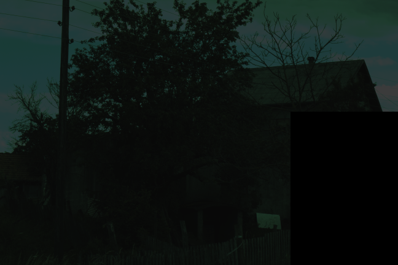
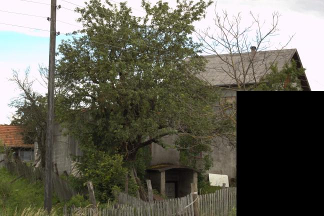
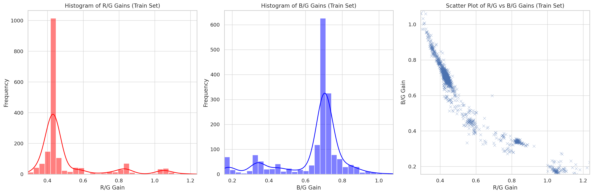
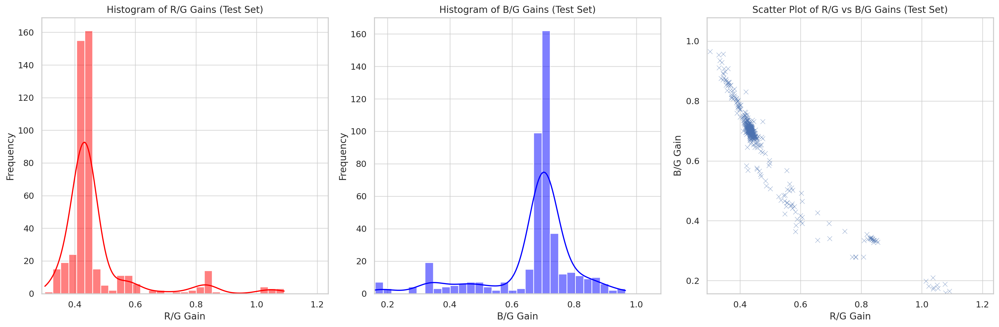
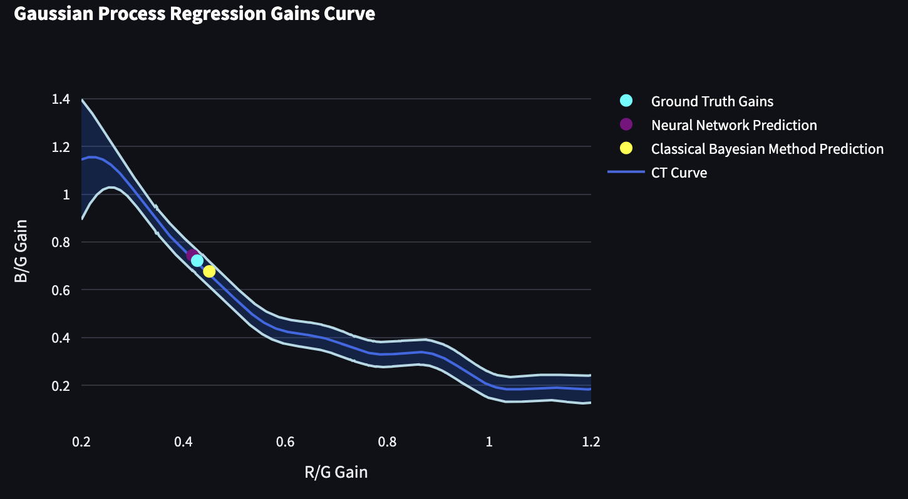
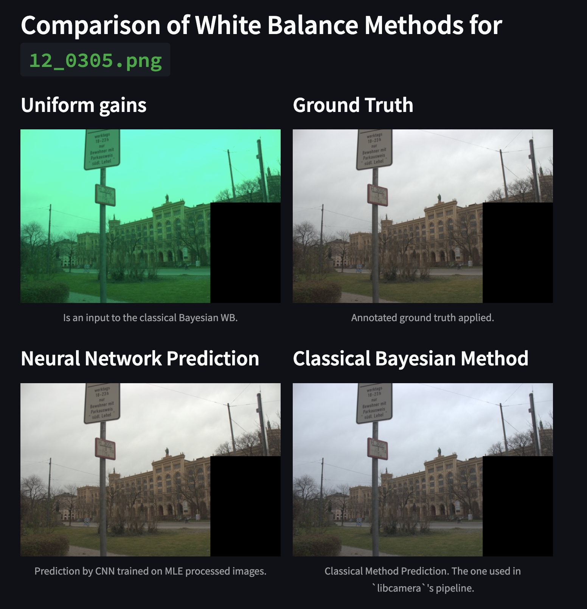
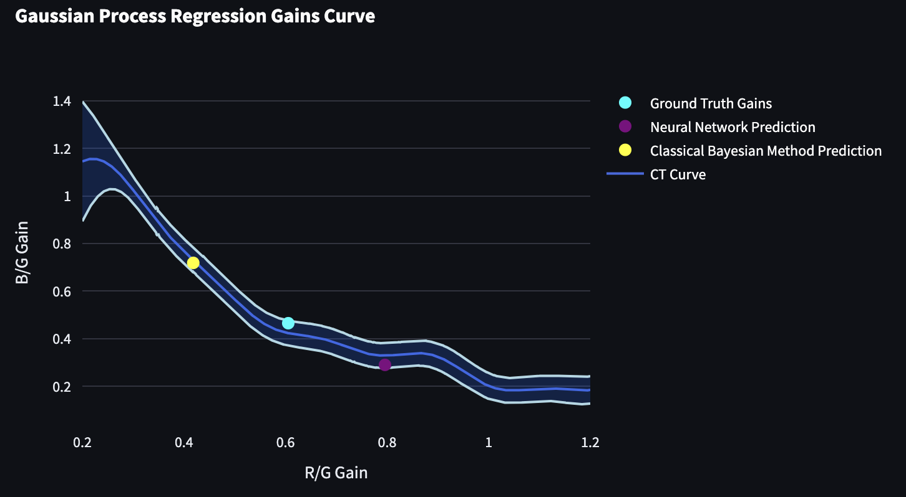
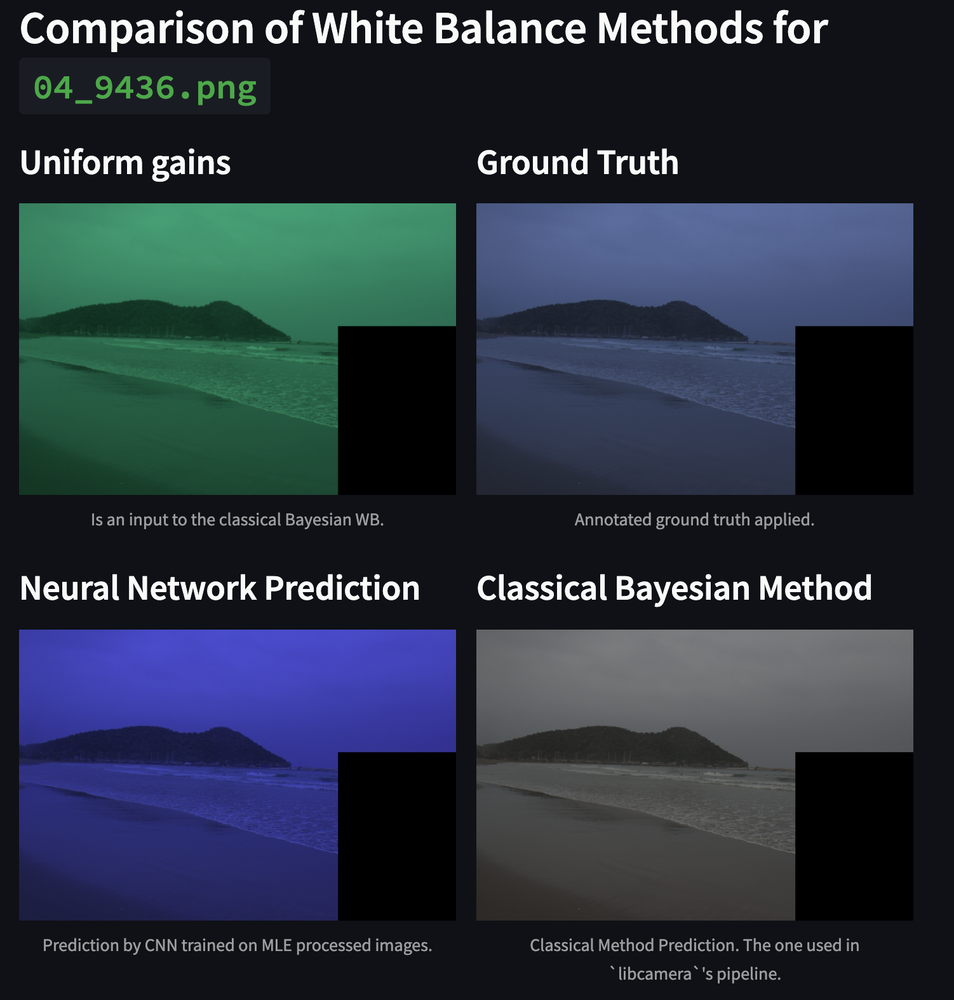

# DeepAWB

Deep Efficient White-Balancing

## Motivation

Camera drivers often must quickly generate the appropriate image processing parameters to avoid delaying the live video stream. In addition, hardware capabilities should be considered. This work explores a deep, single-illuminant, and image-to-gains model for efficient AWB. The final architecture is compared with well-known Bayesian approach in terms of accuracy.

## Limitations

Image-to-image AWB methods are impractical in low-resource environments, as they need to update ISP on every frame. Image-to-gains AWB methods are more robust to sudden scene changes: they output 2 real numbers that scale red and blue image channels.

We do not consider the properties of the illuminants, meaning the predicted gain pairs
are not restricted to a so-called color temperature (CT) curve that can be obtained via
camera calibration.

Somewhat vague and artificial requirements for the good model:

- takes at most 10ms of the CPU time;
- uses up to 100MB of RAM;
- significantly more accurate than the Bayesian approach in [Raspberry Pi's camera guide](https://datasheets.raspberrypi.com/camera/raspberry-pi-camera-guide.pdf).

## Dataset

The training is performed on raw images, as this is what the ISP may provide
on runtime. A small dataset is excellent for showcasing the stability of the approach. One
such dataset is [SimpleCube++](https://ieeexplore.ieee.org/stamp/stamp.jsp?arnumber=9296220). It contains 2234 raw annotated images with ground-
truth gain values. The auxiliary section of the dataset is not utilized. The same scene in RAW and RGB formats:

<div style="display: flex; justify-content: space-between;">
    
    
</div>

### Gain pairs dsitribution in the train set:



### Gain pairs dsitribution in the test set:



One sees that the dataset is highly imbalanced. We use robust weights to help model generalize better.

## Approach

[Ax](https://ax.dev/) framework is used for model architecture search. The search space is defined [here](./src/deep_awb/search_space.py). The sane constraints are enforced to speed up the search process.

2D parametrization of the MLP keeps search space constant. Potentially, this trick can be utilized on other block types.

A final activation function, $tanh$, is scaled to keep the predicted gains in the range of $(0, 1.2)$.

Proof-of-Concept model architecture:

```python
Sequential(
  (0): Sequential(
    (0): ConvReLUMaxPoolBlock(
      (conv_layer): Conv2d(3, 32, kernel_size=(3, 3), stride=(1, 1), padding=(1, 1), bias=False)
      (bn): BatchNorm2d(32, eps=1e-05, momentum=0.1, affine=True, track_running_stats=True)
      (maxpool): MaxPool2d(kernel_size=2, stride=2, padding=0, dilation=1, ceil_mode=False)
    )
    (1): ConvReLUMaxPoolBlock(
      (conv_layer): Conv2d(32, 64, kernel_size=(5, 5), stride=(2, 2), padding=(2, 2), bias=False)
      (bn): BatchNorm2d(64, eps=1e-05, momentum=0.1, affine=True, track_running_stats=True)
      (maxpool): MaxPool2d(kernel_size=2, stride=2, padding=0, dilation=1, ceil_mode=False)
    )
    (2): ConvReLUMaxPoolBlock(
      (conv_layer): Conv2d(64, 128, kernel_size=(5, 5), stride=(2, 2), padding=(2, 2), bias=False)
      (bn): BatchNorm2d(128, eps=1e-05, momentum=0.1, affine=True, track_running_stats=True)
      (maxpool): MaxPool2d(kernel_size=2, stride=2, padding=0, dilation=1, ceil_mode=False)
    )
    (3): AdaptiveAvgPool2d(output_size=(1, 1))
    (4): Flatten(start_dim=1, end_dim=-1)
  )
  (1): Sequential(
    (0): Linear(in_features=128, out_features=130, bias=True)
    (1): ReLU()
    (2): Linear(in_features=130, out_features=47, bias=True)
    (3): ReLU()
    (4): Linear(in_features=47, out_features=17, bias=True)
    (5): ReLU()
    (6): Linear(in_features=17, out_features=6, bias=True)
    (7): ReLU()
    (8): Linear(in_features=6, out_features=2, bias=True)
  )
  (2): LambdaLayer()  # scaled tanh
)

```

(weighted) MSE loss was used during training. Classical bayesian approach achieved a loss of $0.014$, while CNN – of $0.0005$. However, these results are highly biased to the dataset annotations.

## Qualitative Image Comparisons

|  |  |
| :-----------------------------------------------: | :---------------------------------------------------: |
|                     CT Curve                      |                      AWB Methods                      |

|  |  |
| :-----------------------------------------: | :---------------------------------------------: |
|                  CT Curve                   |                   AWB Methods                   |

## Details

We distinguish between NAS and full model training. While on-device runs show the model’s inference time, full model training is independent of the device.

OS-related overhead is not included in inference time calculation; for example, context switches take time, but we do not want to count them as model time. In other words, the CPU time is measured rather than the wall time.

## Future Work

The physical properties of the sensor are neither enforced during training nor inference. Combining classical calibration (restriction to the CT curve) and the deep method is a straightforward improvement to the suggested approach.

When presented with numerous unannotated raw images, which is often the case, one can utilize self-supervised, semi-supervised, or metric learning techniques.

The presented model is highly hardware-specific. Mapping to a camera-independent space will increase the approach’s scalability.

Classify the image as outdoor or indoor, determine the time of day, and then apply a tailored model for that configuration.

The inverse values of actual gains are predicted. One can explore if direct modeling would be easier for the model under limited capacity constraints.
